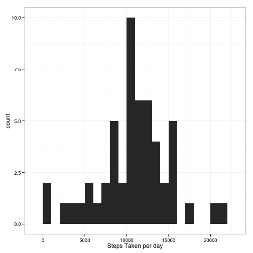
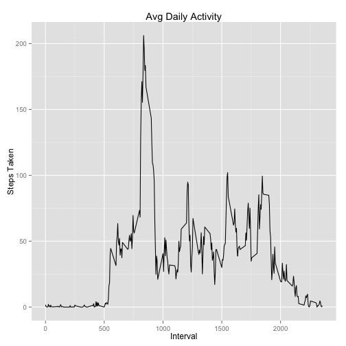
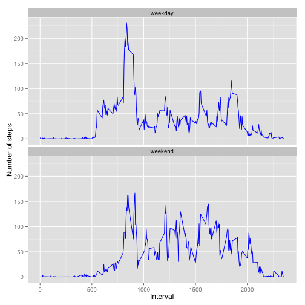

## Load environment and pre-process data

Load Global Libraries


```r
library(knitr)
library(ggplot2)
```

Load and preprocess data


```r
unzip(zipfile="activity.zip")
padata <- read.csv('activity.csv', header = TRUE, sep = ",",colClasses=c("numeric", "character", "numeric"))
```

Scrub data


```r
padata$date <- as.Date(padata$date, format = "%Y-%m-%d")
```

## What is mean total number of steps taken per day?

remove NA values


```r
stepstaken <- na.omit(padata)
```

Calculate and load graph


```r
stepstaken <- tapply(stepstaken$steps, stepstaken$date, FUN = sum)
qplot(stepstaken, binwidth=1000, xlab="Steps Taken per day") + theme_bw()
```

 

Mean and Median 


```r
meansteps <- mean(stepstaken, na.rm=TRUE)
mediansteps <- median(stepstaken, na.rm=TRUE)
```

The mean is 10766.189.  
The median is 10765.


## What is the average daily activity pattern?

```r
avg <- aggregate(x=list(steps=padata$steps), by=list(interval=padata$interval), FUN=mean, na.rm=TRUE)

ggplot(data=avg, aes(x=interval, y=steps)) +   
        geom_line() +  
        labs(title="Avg Daily Activity", x="Interval", y="Steps Taken")
```

 

Max interval


```r
maxinterv <- avg[which.max(avg$steps),]
```
Interval 835 has 206 steps

## Imputing missing values


```r
fulldata <- padata
totalmissing <- sum(is.na(fulldata$steps))
```
There are a total of 2304 missing values in the data.


```r
fillnum <- function(steps, interval) {
    filled <- steps
    if (is.na(steps))
        filled <- (avg[avg$interval==interval, "steps"])
    return(filled)
}

fulldata$steps <- mapply(fillnum, fulldata$steps, fulldata$interval)

nummissing <- sum(is.na(fulldata$steps))
```
There are now 0 steps missing.

## Are there differences in activity patterns between weekdays and weekends?


```r
fulldata$weekday <- as.factor(weekdays(fulldata$date))
weekend <- subset(fulldata, weekday %in% c("Saturday", "Sunday"))
weekday <- subset(fulldata, weekday %in% c("Monday", "Tuesday", "Wednesday", "Thursday", "Friday"))
weekend$dayweek <- c("weekend")
weekday$dayweek <- c("weekday")
newdata <- rbind(weekend, weekday)
newdata$dayweek <- as.factor(newdata$dayweek)
weekavg <- aggregate(steps ~ interval + dayweek, data=newdata, mean)
ggplot(weekavg, aes(interval, steps)) + geom_line(color="blue") + facet_wrap(~ dayweek, nrow=2, ncol=1) +
    xlab("Interval") + ylab("Number of steps")
```

 

Yes there are differences.
